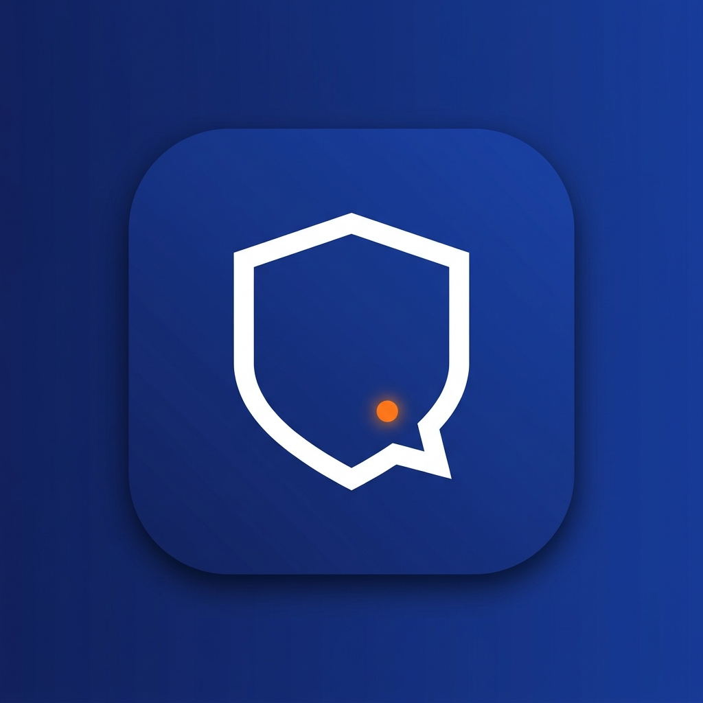

# Spraxe Support

Native Android app for **Spraxe admins and moderators**, built with Kotlin + Jetpack Compose
(Material 3), talking directly to the same Supabase backend as the
[website](https://github.com/roni2026/spraxe-web) and the
[customer app](https://github.com/roni2026/spraxeapp). Where `spraxeapp` is the
customer-facing storefront, **Spraxe Support is the staff app** -- admins and moderators sign
in here to run the whole business from one place, including a real-time live chat with
customers.

<p align="center">
  
</p>

## ⚠️ This is NOT an Expo / React Native project

If `npm install` fails with something like *"no such file"* or *"package.json not found"*,
that's expected: **there is no `package.json`, `app.json`, or any Node/JS code in this repo.**
This is a 100% native Android app written in **Kotlin + Jetpack Compose**, built with
**Gradle** — not Expo/React Native/npm. Open it in Android Studio (or run
`./gradlew assembleDebug` from a terminal with JDK 17) instead of any `npm`/`expo` command.
See the **Setup** section below for the one required config value (`SUPABASE_ANON_KEY`).

## Features

- **Staff-only sign-in**: Email + password against the shared Supabase Auth project. After
  sign-in, the app checks the account's `profiles.role` -- only `admin` and `moderator` are
  let in; a customer account is signed back out immediately with a clear message.
- **Dashboard**: live counts (products, orders, customers, pending orders, open/in-progress
  support chats, pending seller applications) plus the 10 most recent orders.
- **Orders**: browse/search/filter every order, drill into line items, and update order +
  payment status.
- **Live Chat & Support**: every support ticket is a real-time conversation. Staff see new
  customer messages the instant they arrive (Supabase Realtime, no polling), reply inline,
  and change a ticket's status/priority from the same screen. Replying automatically moves a
  ticket from "open" to "in progress".
- **Products**: full catalog CRUD -- create, edit, delete, toggle active/featured, manage
  stock, price, and images.
- **Categories**: full CRUD with sort order and active toggle.
- **Customers**: search customers and view their profile + full order history.
- **Hero Banners & Feature Cards**: manage the website/app's homepage hero banners and the
  "Why Shop With Spraxe" cards.
- **Discount Codes**: create percentage/fixed codes with min purchase and max-use limits,
  toggle active, delete.
- **Seller Applications**: review, approve, or reject marketplace seller applications with a
  rejection reason.
- **Site Settings**: view and edit raw key/value site configuration.
- **Invoices**: read-only list of generated invoices for quick reference.
- Everything above is reachable from one navigation drawer, with the 4 highest-frequency
  screens (Dashboard, Orders, Live Chat, Profile) also pinned to the bottom bar.

## Database dependency

This app needs one migration applied to the same Supabase project used by `spraxe-web` and
`spraxeapp`:

```
supabase/migrations/20260709120000_support_live_chat.sql
```

It:
1. Adds a `moderator` role alongside `customer`/`admin` on `profiles`, and updates Row Level
   Security policies across `products`, `categories`, `orders`, `order_items`, `profiles`,
   `support_tickets`, `seller_applications`, `discount_codes`, `featured_images`,
   `feature_cards`, `site_settings`, and `invoices` so moderators get the same staff-level
   access admins already have.
2. Adds an `assigned_to` column to `support_tickets`.
3. Creates `support_messages` -- the live chat thread for each support ticket -- seeds it
   from every existing ticket's original message, and enables Supabase Realtime on it (and
   on `support_tickets`) so the Live Chat screens update instantly.

Run it via the Supabase SQL editor or `supabase db push` before using Live Chat or signing in
as a moderator.

> To make an existing account staff, run `update profiles set role = 'admin' where id = '<uuid>';`
> (or `'moderator'`) in the Supabase SQL editor.

## Project structure

```
app/src/main/java/com/spraxe/support/
├── data/
│   ├── model/           # Serializable data classes matching the Supabase schema
│   ├── remote/          # SupabaseClientProvider (Postgrest + Auth + Storage + Realtime)
│   └── repository/      # One repository per domain (orders, products, support/chat, ...)
├── ui/
│   ├── components/      # Shared widgets: status badges, stat cards, dialogs
│   ├── navigation/      # Destinations, bottom bar + drawer app scaffold
│   ├── theme/            # Spraxe brand colors/typography (Material 3)
│   └── screens/         # One package per feature area
├── MainActivity.kt
└── SpraxeSupportApplication.kt
```

## Setup

1. Copy `local.properties.template` to `local.properties` and fill in your Supabase project's
   `SUPABASE_URL` and `SUPABASE_ANON_KEY` (matches the same project spraxe-web/spraxeapp use),
   or set them via `gradle.properties` / `-PSUPABASE_ANON_KEY=...`.
2. Apply the migration above to that Supabase project.
3. Open in Android Studio (or `./gradlew assembleDebug` from the CLI) and run.

## Branding

`branding/spraxe_support_logo.png` is the source logo (navy shield + live-chat notch, matching
the Spraxe brand palette). It's already rendered into every `mipmap-*` density as the app's
launcher icon (`ic_launcher` / `ic_launcher_round` / adaptive-icon foreground).

## Notes / next steps

- The website (`spraxe-web`) currently replies to support tickets by email (Brevo). This app's
  Live Chat is the first real two-way conversational channel; wiring a matching chat widget
  into the website/customer app so customers can reply in `support_messages` too is a natural
  next step (the RLS policies in the migration already allow it).
- Built against `io.github.jan-tennert.supabase` BOM `2.6.1`; verify the Realtime API calls in
  `SupportRepository.kt` compile against whatever version you pin, since minor API shapes do
  shift between releases.
